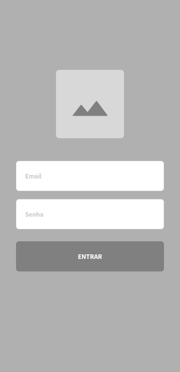
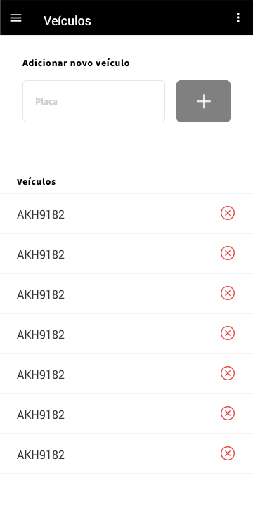

# Frontend Challenge

Desafio Easy Carros para frontend developers.

## Introdução

Você está participando do processo para integrar o time de Produto e Tecnologia da [Easy Carros](https://easycarros.com/).

Este desafio tem como objetivo avaliar seus *skills* na criação de código para frontend para um problema do mundo real.

## O que é a Easy Carros?

A Easy Carros surgiu como uma plataforma de marketplace para serviços automotivos.

O modelo de negócios é parecido com o do Mercado Livre ou do Uber: nós fornecemos a tecnologia que une o consumidor -- pessoa ou empresa que possua veículos automotivos -- com empreendedores independentes, especializados na prestação de serviços como: lavagem a seco, troca de óleo, martelinho de ouro, etc.

## O desafio

Sua missão é criar uma *feature* que existe no Easy Carros Docs: controle de veículos da frota.

A [API](#a-api) com o qual a aplicação deve se comunicar está inclusa neste repositório. 

**Você deverá executá-la para poder se comunicar com ela**. Veja as [instruções](#pré-requisitos).

[Aqui](#endpoints) está a lista de _endpoints_ disponiveis, quais dados devem ser enviados e quais serão retornados.

### 1. Tela de login



#### Permitir que o usuário se autentique na aplicação

Ao enviar o formulário:

- Validar se ambos os campos estão preenchidos.
    - Caso algum não esteja, exibir uma mensagem de erro para o usuário.

Ao receber a resposta do servidor:

- Quando as credenciais de acesso estiverem corretas, o usuário deve ser redirecionado para a página de veículos.
- Quando as credenciais são inválidas, o usuário deve receber uma mensagem informando-o do problema.

Informações adicionais:

Credenciais válidas:

- E-mail: `frontend-dev@easycarros.com`
- Senha: `Fr0nt3ndR0ck5!`

### 2. Tela de lista de veículos



#### Permitir que o usuário visualize seus veículos

Exibir a lista de todos os veículos do usuário mostrando:

- Placa

#### Permitir que o usuário adicione novos veículos

- O usuário informa uma placa no campo logo acima da lista. 
- Ao clicar no botão enviar:
    - Validar se a placa possui 7 caracteres alfanuméricos
        - Caso seja válida, enviar a placa para a API
        - Caso contrário, exibir uma mensagem de erro ao usuário
    - Aguardar a resposta da API
        - Caso seja inserido com sucesso, atualizar a lista de veículos
        - Caso contrário, exibir uma mensagem de erro ao usuário

#### Permitir que o usuário remova um veículo

- Ao clicar no botão excluir, relacionado a cada veículo:
    - Pedir para o usuário confirmar a exclusão
        - Caso positivo: 
            - Enviar a requisição de exclusão para a API
            - Remover o veículo excluído da lista
        - Caso negativo 
            - Manter a lista como está

## As regras do jogo

- 📃 A aplicação **deve** ser uma SPA ou um mobile app.
- 🈴 Use o framework com o qual você se sente mais confortável (aqui nós utilizamos principalmente **React** e **ReactNative**, mas qualquer framework "mainstream" é bem vindo).
- 🖌️ Fique à vontade para modificar a aparência das telas; os wireframes são apenas para referência.
- 🛰️ Use qualquer bibloteca para conseguir se comunicar com o backend.
- 🚢 Envie seu código para um repositório público para leitura (Github, Bitbucket, Gitlab, etc.).
- 🗒️ Crie um arquivo `README` na raiz do projeto com instruções detalhadas de como executar seu código.

### Bônus

- 📑 Unit tests para seus componentes.

### Como vou ser avaliado?

Vamos analisar seu código com respeito a:

- Qualidadade de código
    - Keep it simple! (KISS)
- Boas práticas
    - Separation of Concerns (SoC)
    - Design patterns (se houver necessidade)
    - Clean code
- Code styling
    - Use um code linter 🙏

O que **NÃO** vamos analisar:

- Performance
- Escolha da tecnologia A em vez da B

## Para onde enviar seu repositório

Envie um email para `tech@easycarros.com` com o assunto `Desafio Frontend - [SEU NOME]` contendo o link para o repositório que você criou.

---


## A API

### Pré-requisitos

Você deve instalar os seguintes pacotes antes de prosseguir:

 - [`yarn`](https://yarnpkg.com/lang/en/docs/install)

### Executando o servidor da API

Na raiz deste projeto, rode:

```bash
cd ./api
yarn install # vai demorar um pouco
yarn start # o servidor irá escutar a porta 8181 por padrão
```

Se tudo correr bem, você verá a seguinte mensagem no seu terminal:

> App is listening on http://localhost:8181

#### Solução de problemas

Se ao executar `yarn start` você se deparar com um erro parecido com:

```
> Error: listen EADDRINUSE :::8181
>    at Server.setupListenHandle [as _listen2] (net.js:1330:14)
>    at listenInCluster (net.js:1378:12)
>    at Server.listen (net.js:1466:7)
>    ...
```

Significa que a porta `8181` está em uso no seu computador. Para utilizar uma porta diferente, rode:

```bash
PORT='<OUTRA PORTA>' yarn start
```


### Endpoints
Este repositório contém a API que será utilizada como backend da sua aplicação. Ela possui os seguintes endpoints:

1. `POST /auth`
    - Headers:
        - Content-Type: `application/json`
    - Body:

            {
                "email": String
                "password": String
            }

    - Response:
        - Quando as credenciais são válidas:
            - Status Code: `200`
            - Body:

                    {
                        "data": {
                            "token": String
                        }
                    }

        - Quando as credenciais são inválidas:
            - Status Code: `401`
            - Body:

                    {
                        "error": {
                            "message": String
                        }
                    }

2. `GET /vehicle`
    - Headers:
        - Content-Type: `application/json`
        - Authorization: `Bearer {{token}}`

    - Response:
        - Quando o token é válido:
            - Status Code: `200`
            - Body:

                    {
                        "data": [
                            {
                                "id": String
                                "plate": String
                            },
                            {
                                "id": String
                                "plate": String
                            },
                            // ...
                        ]
                    }

        - Quando o token é inválido ou inexistente:
            - Status Code: `401`
            - Body:

                    {
                        "error": {
                            "message": String
                        }
                    }

3. `POST /vehicle`
    - Headers:
        - Content-Type: `application/json`
        - Authorization: `Bearer {{token}}`

    - Body:

            {
                "plate": String
            }

    - Response:
        - Quando o token e a placa são válidos:
            - Status Code: `200`
            - Body:

                    {
                        "data": {
                            "id": String,
                            "plate": String
                        }
                    }

        - Quando o token é inválido ou inexistente:
            - Status Code: `401`
            - Body:

                    {
                        "error": {
                            "message": String
                        }
                    }

        - Quando a placa é inválida ou inexistente:
            - Status Code: `400`
            - Body:
            
                    {
                        "error": {
                            "message": String
                        }
                    }

4. `DELETE /vehicle/{{id}}`
    - Headers:
        - Content-Type: `application/json`
        - Authorization: `Bearer {{token}}`

    - Response:
        - Quando o token é válido:
            - Status Code: `204`
        - Quando o token é inválido ou inexistente:
            - Status Code: `401`
            - Body:

                    {
                        "error": {
                            "message": String
                        }
                    }
